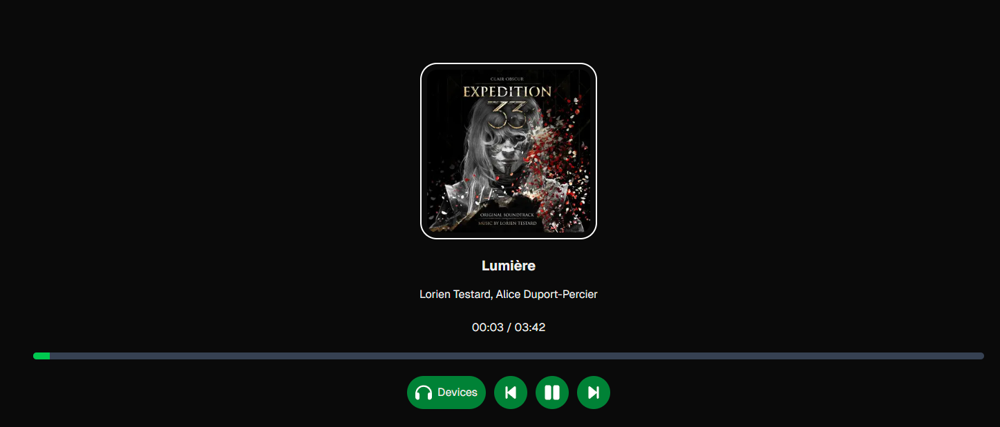

Simple Spotify controller made using [Next.js](https://nextjs.org) and bootstrapped with [`create-next-app`](https://nextjs.org/docs/app/api-reference/cli/create-next-app).

## Features

- Play, pause, and skip music being played on any Spotify instance.
- View info on currently playing song
- Switch between available Spotify devices




## Getting Started

First, run the development server:

```bash
npm run dev
# or
yarn dev
# or
pnpm dev
# or
bun dev
```

Open [http://localhost:3000](http://localhost:3000) with your browser to see the result.